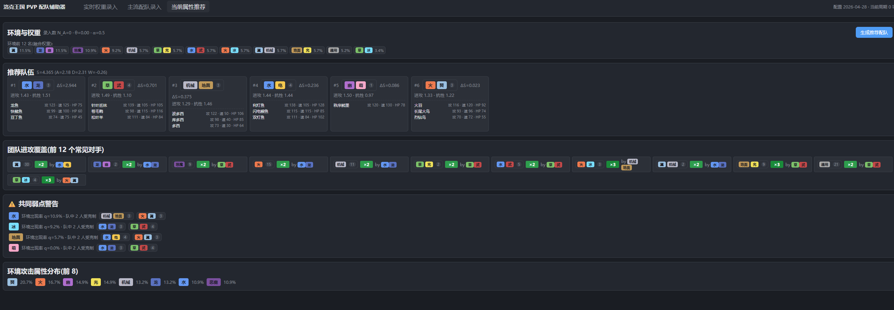
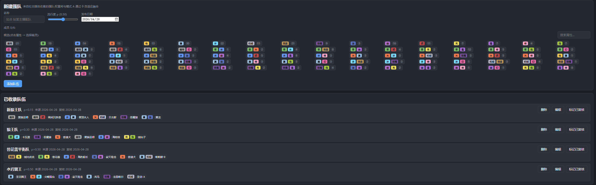

# 洛克王国 PVP 配队辅助器

完全本地化的 Windows 桌面应用,基于属性克制的 PVP 配队推荐工具。





## 应用特色

- **完全本地化**：无任何联网请求,无账号、无云同步,所有对局数据与配置仅写入本机 `%APPDATA%`,关掉应用即停止任何 I/O。
- **轻量安装**：基于 Tauri 2 + Rust 壳,而非 Electron;典型 NSIS 安装包 < 15 MB,运行时常驻内存 < 100 MB,与浏览器内核共享系统 WebView2,不重复打包 Chromium。
- **零依赖运行**：发行版只需一个 `.exe` / 安装包,不依赖 Node、Python 或任何外部服务,可离线长期使用。
- **数据可读可改**：对局事件以 JSONL append-only 写入,克制矩阵、双属性白名单、强队列表均为人类可读 JSON,可手工编辑或脚本批处理。
- **两种数据来源融合**：自录对局(模式 A)和主流强队(模式 B)按可调权重 θ 加权融合 —— 早期主要参考主流配队,数据足够多以后逐步过渡到自家对局分布。
- **即开即用**：克制矩阵已从游戏内截图提取并预置;首次启动可直接获得基于通用先验的推荐,无需先录入数据。
- **可解释性**：推荐结果给出每只精灵的边际贡献 ΔS、团队覆盖热力图、共同弱点警告,而不是黑箱打分。

## 工作原理(算法概述)

应用的核心目标是回答一个问题：**面对当前 PVP 环境,哪 6 只精灵组成的队伍综合得分最高？**

整个流程分为三步:

### 1. 估计"环境分布" w_k

我对环境中"对手用什么队伍/精灵"建立了一个概率分布 `w_k`(双属性 k 出现的频率),由两路数据合成:

- **模式 A —— 自录对局**：每一场 PVP 我把对手的双属性记录到 `battle_events.jsonl`。原始频率在样本少时方差很大,所以使用 **Dirichlet 先验平滑**：
  > w<sub>k</sub><sup>A</sup> = (n<sub>k</sub> + α<sub>0</sub>) / Σ<sub>j</sub>(n<sub>j</sub> + α<sub>0</sub>)

  α₀ 相当于给每个双属性一个虚拟"伪计数",防止没见过的组合权重为 0。

- **模式 B —— 主流强队**：每支收集到的强队按其热度 ρ 摊到 6 名成员上,再归一化。
- **自适应融合**:
  > θ(N<sub>A</sub>) = N<sub>A</sub> / (N<sub>A</sub> + N<sub>0</sub>)
  >
  > w<sub>k</sub> = θ · w<sub>k</sub><sup>A</sup> + (1 − θ) · w<sub>k</sub><sup>B</sup>

  自录对局少时(N<sub>A</sub> ≪ N<sub>0</sub>)主要参考主流配队;数据多了以后 θ → 1,以自家观测为准。N₀ 决定"切换点"。

### 2. 给一支队伍 P 打分

总分由三项加权组合:

> S(P) = λ<sub>A</sub> · A(P) + λ<sub>D</sub> · D<sub>switch</sub>(P) + λ<sub>W</sub> · D<sub>weak</sub>(P)

- **A(P) 攻击覆盖**：对每个可能的对手 k,取我方队伍中"最好的那只 + 它最克制的招式属性"对应的克制倍率;按 w<sub>k</sub> 加权求和。直觉：每个对手只要队里有一只能打它就够了。
- **D<sub>switch</sub>(P) 安全切换**：对每个对手 k,取我方"最抗它 STAB 招式"的精灵,衡量"换人垫刀"的余地。
- **D<sub>weak</sub>(P) 共同弱点惩罚**(负项)：如果队伍里有 c 只都被某个攻击属性 i 克(2× 及以上),且 c 超过冗余阈值 r,扣分 q<sub>i</sub> · (c − r)²。**二次方惩罚**让"全队三只都怕电"这种结构性问题被强烈打压。

λ<sub>A</sub> / λ<sub>D</sub> / λ<sub>W</sub> 可在设置页用滑块调节,代表使用者偏攻击型还是偏稳健型。

### 3. 贪心选队

枚举 18×18 = 324 个双属性组合的全部子集是 C(324, 6) ≈ 10¹⁰,不可行。我用 **边际收益贪心**：

```
P = []
重复 6 次:
    选 ΔS = S(P + [p]) − S(P) 最大的 p 加入 P
```

由于 D<sub>weak</sub> 是凸的(共同弱点惩罚二次方增长),A(P) 取外层 max,贪心天然倾向于选属性互补的队伍 —— 第一只往往是当前环境最强单点,后续每一只都在"补漏"而非堆叠同质收益。每一步都会记录 ΔS 供 UI 解释"为什么是它"。

## 工程结构

```
app/
├── src/                          Vue 3 + TypeScript 前端
│   ├── core/                     纯 TS 引擎(无 Vue / Tauri 依赖)
│   │   ├── types.ts              数据模型
│   │   ├── matrix.ts             EffectLevel 整数算术 + M 表预计算
│   │   ├── stats.ts              Dirichlet 平滑、双模融合 θ
│   │   ├── scoring.ts            A(P) / D_switch(P) / D_weak(P)
│   │   ├── recommend.ts          贪心 + 边际收益
│   │   ├── config.ts             读取打包内 / AppData 配置
│   │   └── persistence.ts        Tauri fs JSONL/JSON 读写
│   ├── store/app.ts              Pinia 单一 store
│   ├── views/                    InputView / RecommendView / SettingsView
│   ├── components/               TypeBadge / ComboChip
│   └── App.vue, main.ts, router.ts, style.css
├── src-tauri/                    Rust 壳 (Tauri 2)
│   ├── Cargo.toml
│   ├── tauri.conf.json
│   ├── capabilities/default.json
│   ├── resources/config/         打包内置静态配置
│   │   ├── type_matrix.json      18×18 克制矩阵(从图片提取)
│   │   ├── valid_duals.json      双属性白名单(占位,需按游戏更新)
│   │   └── manifest.json
│   └── src/{main.rs, lib.rs}
├── scripts/extract_type_matrix.py   从 洛克王国.png 提取矩阵的工具
└── package.json
```

## 运行

前置条件:
- Node.js ≥ 18
- Rust toolchain (rustup, cargo)

```bash
cd app
npm install              # 首次
npm run tauri dev        # 桌面 dev 模式(首次 Rust 编译耗时 ~10 分钟)
```

## 构建发行版

```bash
npm run tauri build
```

输出位于 `src-tauri/target/release/bundle/`,包括 `.exe` 和 NSIS 安装包。

## 用户数据位置

Windows: `%APPDATA%\com.simplerocopvp.helper\user-data\`

- `battle_events.jsonl` —— 模式 A 录入的对局事件(append-only)
- `community_teams.json` —— 模式 B 收集的强队
- `settings.json` —— 用户参数(λ、α₀、N₀、统计周期等)

## 数据维护

### 克制矩阵数据形式

```json
{
  "version": "2026-04",
  "schema_version": 1,
  "types": ["通用","草","水","火","电","翼","冰","机械","地面",
            "恶魔","龙","幽","武","光","毒","萌","虫","幻"],
  "matrix": [
    [1, 1, 1, 1, 1, 1, 1, 0.5, 0.5, 1, 1, 0.5, 1, 1, 1, 1, 1, 1]
    // ... 17 more rows
  ]
}
```

### 双属性白名单

`src-tauri/resources/config/valid_duals.json` 当前为占位数据。
请根据游戏内实际存在的双属性精灵填写;
ID 应稳定不变,作为 `battle_events.jsonl` 的外键。

## v0.1.0 范围(已实现)

- 加性层级模型 + 整数 EffectLevel
- 数据 JSONL 持久化
- Dirichlet 先验平滑 + 双模融合 θ
- 团队评分 A + D_switch + D_weak
- 贪心推荐 + 边际收益追踪
- 团队覆盖热力图 + 共同弱点警告
- λ 滑块、α₀ / N₀ 设置、统计周期重置
- 攻击方算法计算考虑的是打击面(考虑精灵使用非本系技能)而非属性克制面

## 后续可优化与新增方向(无先后顺序)

### 算法层
- **ε-探索机制**：当前贪心是纯 exploit,缺乏对"小众但反制当前 meta"的搭配的探索;计划在每一步以 ε 概率随机选 top-K 中一只,并对配置版本支持回滚。
- **Beam Search / 2-swap 局部优化**：贪心会陷入局部最优(例如前两只选错导致第三只起补不回来)。Beam-K + 终末阶段两两交换可在可接受的算力下显著逼近最优。
- **种族值与个体差异**：目前只考虑双属性 + STAB 招式,不区分同属性的不同精灵。后续会引入种族值、性格、天赋(个体值)三维,把"火系输出"从粗粒度类型细化到具体精灵。
- **打击面扩展**:已支持非本系招式打击面(`moveTypeSet`),后续把每只精灵的常用 4 招直接录入,而不是当前的"属性 → 默认 STAB"近似。
- **环境时间衰减**：当前 Dirichlet 平滑没有时间衰减,旧赛季的对局会和本周对局同等参与统计。计划加入指数遗忘 e<sup>−Δt/τ</sup>,让 meta 切换时权重自然过期。

### 数据与可用性
- **导入 / 导出 / 配置包**："实时权重录入"和"主流配队录入"目前只能在 UI 内手填,后续支持 CSV / JSON 一键导入,以及社区共享配置包(克制矩阵 + 双属性白名单 + 主流强队)的版本化升级流程。
- **对局事件批量编辑**：录错或想撤销时,目前需要直接改 JSONL。计划在 UI 提供按时间段筛选 / 批量删除 / 撤销最近 N 条。
- **多档位推荐**：除了"最优 6 队",同时给出"激进型 / 稳健型 / 反 meta 型" 几个不同 λ 组合下的备选,便于用户对比。

### 平台
- **Android 移植**：Tauri 2 已支持 Android,把当前桌面壳迁过去,主要工作是 fs 路径与触屏交互适配。
- **多语言**：目前仅简中
